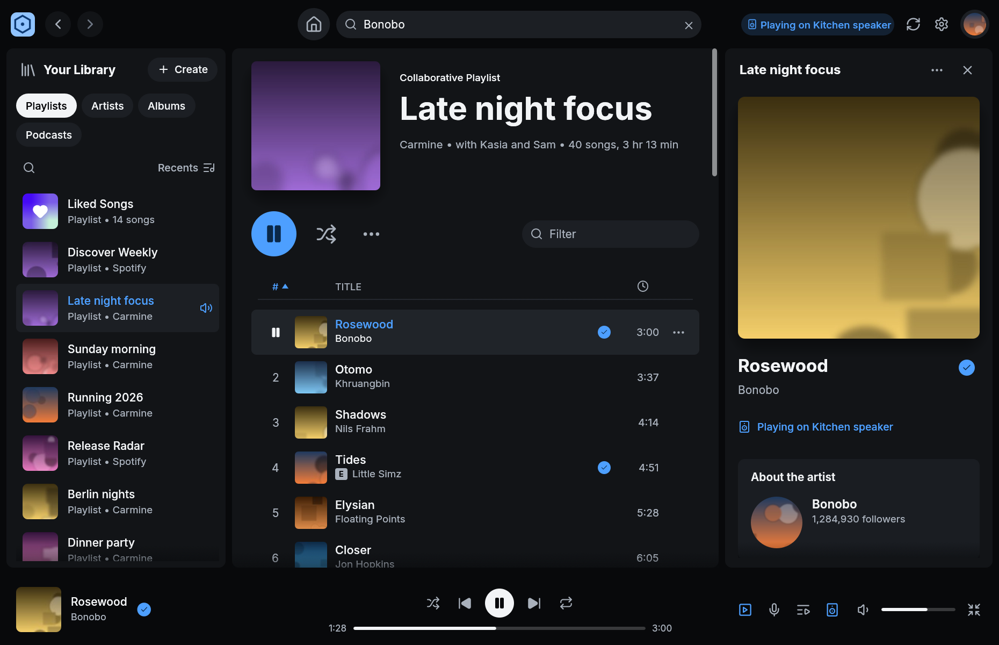

# Oxidify

**Your library, native and fast.** A lightweight music player for your
Spotify library, written in Rust with [egui](https://github.com/emilk/egui),
playing music through [librespot](https://github.com/librespot-org/librespot).
It runs on Linux, macOS, and Windows, starts in well under a second, and
stays small while it runs. There is no browser engine anywhere in the
process.

Oxidify is derived from
[Fastpotify](https://github.com/crmne/fastpotify) and keeps its familiar
layout, library access, and Spotify Connect receiver in one desktop
application, adding resilient alternate local playback for accounts that
cannot use Spotify Connect.



**Documentation:** the `docs/` directory builds the site: what it is,
getting started, everyday use, and how it connects to Spotify.

## What it does

- **Plays music on this computer.** Oxidify is a Spotify Connect device by
  default. Pick it from your phone, or press play here. Gapless, up to 320
  kbps, with optional volume normalisation and an on-disk audio cache.
  Sample-rate conversion stays continuous across packets when the output
  cannot use Spotify's native 44.1 kHz rate. An
  **alternate local audio** mode keeps Spotify metadata and plays a
  third-party match instead; that is not Spotify audio and not Spotify
  Connect.
- **Plays without Premium.** Free and unconfirmed accounts are routed to
  alternate local audio instead of attempting Spotify playback; Premium
  users can select it too. See [Alternate local audio](#alternate-local-audio)
  for exactly what that does and does not promise.
- **Controls every other device.** Move playback to a speaker, a phone, or
  another computer from the device picker, and keep controlling it: play,
  pause, skip, seek, shuffle, repeat, volume. Devices that refuse remote volume
  changes show disabled volume controls instead of failing requests.
- **Finds speakers on your network.** A librespot, spotifyd, or hardware
  receiver waiting on the LAN is invisible to Spotify's API until it has an
  account. Oxidify discovers those over mDNS and connects them for you,
  after which they behave like any other Spotify Connect device.
- **The layout you know.** One bar across the top holds navigation, Home,
  search, and your account; Your Library, the page, and an optional side
  panel sit beneath it as separate rounded panels, with the player bar
  along the bottom.
- **Library access.** Playlists, Liked Songs, saved albums, followed
  artists, podcasts, and saved episodes, filterable in Your Library and as
  full pages. Library rows pin to the top and drag into your own order, and
  the panel folds down to a rail of covers when the page needs the room.
  The sort control switches between recently played and your own order and
  between full rows, compact rows, and a grid of covers; Appearance does the
  same for track tables.
- **Now Playing view.** A panel beside the page with the playing cover
  large, the artist, and what is next in the queue, from the button in the
  player bar or the arrow on the playing cover.
- **Search** across songs, artists, albums, playlists, podcasts, and episodes,
  with a top result and per-type views. A search goes out as two requests
  at once, the catalogue and the playlists, and each shows the moment it
  lands; typing on cancels the ones still travelling.
- **Home** with shortcuts to what you played last, Made for you, Recently
  played, your top artists and songs, and recommendations, with chips to
  show all of it, music only, or your podcasts and saved episodes. The full
  Top songs page restores its first 50 songs from an account-scoped cache
  (up to six hours old), then refreshes from Spotify.
- **Artist pages** with popular songs, a filterable discography, and related
  artists. **Album**, **playlist**, and **podcast** pages support playback
  from any row. Started podcast episodes continue from their saved position;
  finished episodes start over. Playing an episode inside a playlist keeps
  that playlist and its displayed order.
- **Refresh the current page** with the circular arrow beside Settings in
  the top bar. It requests fresh Spotify data, bypassing the page's
  metadata cache while still respecting Spotify rate limits.
- **Responsive track tables.** Sorted and filtered views are cached between
  frames and refreshed when their inputs change. Sorted Liked Songs also
  plays in its displayed order from the page's play button.
- **Playlists you own** can be created, renamed, described, reordered, and
  edited: add from any row's menu (type to find the destination) or by dragging
  a song, including the one that is playing, onto a playlist in the sidebar or
  between rows of an open playlist. Adding a song that is already there asks
  first. The destination filter stays open while you type or scroll. Remove
  from the playlist page even while sorted or filtered; positional moves are
  available only in the playlist's original order.
- **Queue** as a side panel or a page; it names what is playing from, and
  anything can be added to it from a row menu.
- **Lyrics** beside whatever is playing, timed lines that follow the song,
  from Spotify or [LRCLIB](https://lrclib.net).
- **Album-art colour.** Pages and the player bar can take a tint from the
  cover of what you are looking at or listening to, and the bar fades from
  one song's colour to the next. Turn it off in Settings and the interface
  stays in its neutral chrome. The accent is Oxidify's blue; Settings →
  Appearance offers a green instead.
- **Light and dark**, or follow the system.
- **Winamp mini player.** `Ctrl+M`, or the button at the right end of the
  player bar, turns the window into a tiny player that
  wears classic `.wsz` skins, drawn pixel for pixel at 1x to 4x, with the
  spectrum analyser, the playlist, and the equalizer hanging under it as
  they did; the logo in the skin brings the big window back. Drop a skin
  from the [Winamp Skin Museum](https://skins.webamp.org) on either window
  to add it.
- **Equalizer.** Winamp's ten bands and presets for local Spotify playback,
  in Settings and in the skin. AUTO on the skin lays the bands flat. The bands
  compensate for their overlap so their combined response meets the sliders;
  the graph uses the same digital filters as playback. Alternate audio does
  not yet use the equalizer.
- **Liked Songs in two presses.** The plus beside a song adds it to Liked
  Songs. Once it is there, the check opens the places it can go: the
  playlists you can edit, filtered as you type (Enter takes the first
  match, playlists already holding the song are marked), or out of Liked
  Songs again.
- **Keyboard-first.** Every common action has a shortcut (`Ctrl+/` or `?` lists
  them).
- **Keeps playing when you close the window.** The window closes for real,
  the music and the process stay in the system tray (Linux status notifier),
  and clicking the tray, or your desktop's media controls, brings a window
  back. No compositor-specific tricks, so it behaves the same on any
  desktop. Quit from the tray menu or `Ctrl+Q` (or `oxidify quit` on Windows
  and macOS); turn the behaviour off in Settings if you prefer close-to-quit.
  On macOS the Dock icon stays present,
  and clicking it opens the window again.
- **Update notices.** A small **Update available** button opens the official
  GitHub release page in your browser, with installers for every supported
  platform. Checks run once a day, or from Settings → About → Check for
  updates. Automatic checks can be turned off; nothing installs itself.
- **Visible network activity.** Pages show spinners while they load. An
  indicator appears in the top bar when a Spotify request takes more than a
  moment or is waiting for a rate limit.
- **One instance.** Launching it again brings the existing window forward
  instead of starting a second copy, on every platform.
- **Desktop integration.** MPRIS on Linux, so media keys, the shell, and
  `playerctl` see Oxidify like any other player. On macOS and Windows,
  `oxidify next` and its siblings drive the running app from a terminal,
  a launcher, or a hotkey.

## Install

Prebuilt binaries and installers for macOS, Windows, and Linux live on the
[releases page](https://github.com/Master0fFate/oxidify/releases). Or build
the single binary yourself with a stable Rust toolchain (1.95 or newer):

```bash
cargo install --path .
```

On Linux you also need the development packages for ALSA, PulseAudio (which
covers PipeWire), and the usual windowing libraries, for example on Arch:

```bash
sudo pacman -S --needed alsa-lib libpulse libxkbcommon wayland
```

and on Debian or Ubuntu:

```bash
sudo apt install libasound2-dev libpulse-dev libxkbcommon-dev libwayland-dev
```

With [Nix](https://nixos.org), `nix develop` provides all of it, along with
the exact toolchain `rust-toolchain.toml` pins.

Titles in a script the interface font does not cover -- Chinese, Japanese,
Korean, Arabic, Hebrew, Thai, the Indic scripts and a dozen more -- are drawn
with a face borrowed from the system rather than bundled, which would cost
more than ten megabytes for Chinese alone. macOS and Windows carry faces for
the common ones; on Linux install the Noto families for the scripts you
listen to, for example `noto-fonts` and `noto-fonts-cjk` (Arch) or
`fonts-noto` and `fonts-noto-cjk` (Debian or Ubuntu). A script with no face
installed still shows as empty boxes.

A desktop entry is provided in `packaging/applications/oxidify.desktop`.

Coming from Fastpotify? The first run imports your settings, sign-ins,
skins, and playback credentials from Fastpotify's directories, once, and
never writes back to them.

## Sign in

Press **Sign in with Spotify**. Your browser opens Spotify's own consent
page (Authorization Code with PKCE); Oxidify never sees your password.
When Spotify redirects back to the app, your library, search, and control
of other devices work immediately. If the browser does not open, the waiting
screen can open the sign-in page again or copy its link for manual use. The
refresh token is stored in the platform's state directory
(`~/.local/state/oxidify` on Linux), so the browser is needed once per machine.

Playing music **on this computer** through Spotify Connect is one more
one-time browser approval. Spotify treats streaming as a separate grant for
its own client identity, which is what librespot plays with. Take it from
the device menu ("Play here, set up once") or Settings; it needs Spotify
Premium, and librespot stores a reusable credential so it also never asks
again. Browsing and remote control work on any account without this step.

The Web API always keeps shared catalog coverage. You can also register a
personal Spotify Development Mode app and paste its Client ID in Settings →
Account; supported requests use its separate quota while complete playlist
views, playlist-bearing search, external playlists, and unavailable operations
continue through the shared app.

### Personal Web API app (optional)

Settings → Account → **Show me how** opens an in-app setup tutorial.
Create an app in the [Spotify developer dashboard](https://developer.spotify.com/dashboard)
(app owners need Premium), select **Web API**, and register this exact
**Redirect URI** in the app's Settings:

```text
http://127.0.0.1:8989/login
```

Save the dashboard settings, paste the **Client ID** (not the Client Secret)
into Oxidify, then click **Authorize** using the same Spotify account.
Settings shows **Authorizing…** during approval and verification, then
**Authorized** with a separate **Remove** control once verified.
Settings also has a **Copy URI** button. If Spotify says
`redirect_uri: Not matching configuration`, check the app matching that Client
ID: use `127.0.0.1`, not `localhost`, keep `/login`, omit any trailing slash,
and save before retrying. Oxidify cannot register the URI on your behalf.
See the [full setup guide](docs/_guide/make-it-even-faster.md).

## Alternate local audio

For a Free account, or until Spotify confirms Premium, Oxidify selects
**Alternate local audio** instead of attempting Spotify playback. Premium
users can also select it under Settings → Playback on this computer. This
mode still talks to the Spotify Web API for library, search, and metadata,
then searches native YouTube and, if you configured one, a Piped-compatible
endpoint in parallel. All results use the same title, artist, duration, and
mismatch score; the higher-scoring source wins. A match at 90% or above ends
the race early and cancels slower providers.

Native asynchronous Rust HTTP is used for YouTube **search**. Playable stream
URLs come from Piped, if you set one, otherwise `yt-dlp` asking only for AAC
M4A (itag 140) or MP3. rusty_ytdl lists those formats but does not decrypt
their URLs, so it is not used for playback. Search results are cached for six
hours and resolved media URLs for ten minutes. HTTP range fetch starts from
headers and seeks into undownloaded regions; the rest of the file is not
pulled unless you listen or seek there. Release builds
embed one official pinned `yt-dlp` executable, extract it into the local state
directory, and never download it at runtime. A user-installed `yt-dlp` is used
only when its version is strictly newer than the pin. Spotify tokens are never
sent to those tools, and the result is not Spotify audio. You are responsible
for the endpoint and any binary you run, and for their terms of use. Nothing
here is approved or authorized by Spotify or by YouTube, and Oxidify makes no
claim that it is.
Podcasts are not supported in that mode. Weak matches are never played.
Playback starts when audio headers are in, not after a fixed time buffer,
and the player bar then shows the matched recording's own length, which
is rarely exactly Spotify's, so the position and seeking follow what is
actually playing.
An M4A file with its `moov` atom at the end may wait until the download
finishes. Alternate playback does not select Opus, WebM, or Ogg/Vorbis:
YouTube's useful native alternative is WebM/Opus, and Opus is not decoded.
Network stalls and transient HTTP errors retry with bounded backoff and
resume from the ranges already received; expired media URLs are refreshed.
A terminal transport or decode failure stops the current track instead of
skipping it.

## Account safety

We are not aware of a Spotify account being suspended for using Oxidify
or another librespot player with Premium. Sign-in happens on Spotify's own
pages, audio uses the quality included with Premium, DRM stays intact, and
Oxidify does not rip tracks or block ads.

Reported suspensions usually involve modded apps that remove ads from free
accounts, track ripping, or stream manipulation. Oxidify does none of
those things, and [CONTRIBUTING.md](CONTRIBUTING.md) prohibits them.

Alternate local playback is different: it does not stream from Spotify at
all. Whether matching and playing third-party audio is acceptable under the
terms of your account and of the services you point it at is your
responsibility; see the section above.

## Keyboard shortcuts

| Shortcut | What it does |
| --- | --- |
| `Space` | Play or pause |
| `Ctrl+←` / `Ctrl+→` | Previous or next |
| `Shift+←` / `Shift+→` | Seek 10 seconds |
| `Ctrl+↑` / `Ctrl+↓` | Volume |
| `M` | Mute |
| `B` | Like or unlike the playing song |
| `S` / `R` | Shuffle / cycle repeat |
| `Q` | Queue panel |
| `Ctrl+F` or `/` | Search |
| `Ctrl+B` | Show or hide Your Library |
| `Alt+←` / `Alt+→`, or mouse side buttons | Back or forward |
| `Ctrl+H` / `Ctrl+L` | Home / Liked Songs |
| `Ctrl+Shift+A` / `Ctrl+Shift+B` | Playing artist / album |
| `Ctrl+M` | Winamp mini player |
| `Ctrl+,` | Settings |
| `Ctrl+/` or `?` | All shortcuts |
| `Ctrl+Q` | Quit |

On macOS, `Cmd` replaces `Ctrl`.

## Controlling it from outside

On Linux, Oxidify is an MPRIS player, so `playerctl --player=oxidify
play-pause` already works.

macOS and Windows have no such bus, so the same verbs are subcommands. They
talk to the instance already running and print nothing on success:

```
oxidify play-pause          oxidify volume 40
oxidify play                oxidify volume-up [percent]
oxidify pause               oxidify volume-down [percent]
oxidify next                oxidify mute
oxidify previous            oxidify shuffle [on|off]
oxidify seek 15             oxidify repeat [off|context|track]
oxidify seek -- -15         oxidify like
oxidify seek-to 90          oxidify play-uri spotify:playlist:37i9…
oxidify show                oxidify transfer <device-id>
oxidify now-playing [--raw] oxidify devices [--raw]
```

`shuffle` and `repeat` toggle when asked for nothing in particular and set
the state outright when given one, which is what a button that draws the
current state wants: a missed update otherwise leaves the two disagreeing
until the next press. `like` saves the playing track to your library, or
takes it back out.

`now-playing` prints one readable line; `--raw` prints the fields
tab-separated (state, title, artists, album, position_ms, duration_ms,
volume, shuffle, repeat, art_url, saved, device) for a script that wants
one of them. `saved` is `yes`, `no`, or `unknown` while the answer is still
on its way. The last three fields were added after the first nine, and
appended rather than woven in, so a script written against the older shape
still reads correctly.

`devices` lists the Spotify Connect devices, id first, the active one
marked with `*`; `--raw` prints them as JSON. The app only refreshes that
list while its own picker is open, so asking for it also asks it to look
again: on a cold list the first call can come back empty and the next one
has it.

A verb exits non-zero when Oxidify is not running.

Launchers such as Raycast or Alfred can use these commands to control
playback. The Stream Deck plugin speaks the same channel, which is why
the verbs cover more than a media key can ask for.

## Settings

Settings live in one readable JSON file (`~/.config/oxidify/settings.json`
on Linux). They include the Connect device name, bitrate, normalisation,
autoplay, gapless playback, the audio backend (PulseAudio/PipeWire or ALSA
on Linux), audio cache size, theme, accent, whether Your Library is shown,
folded to a rail, or a grid, whether pages take colour from artwork, the mini player's skin and size, and the alternate
playback fields (`playback_backend`, `piped_api_base`, `ytdlp_path`,
`alternate_min_score`, `alternate_skip_on_miss`).
Playback settings apply when you press **Apply and restart playback**.
Switching source stops the other engine so both never run at once. The
default remains Spotify Connect.

Caches (audio, artwork) live under the cache directory and can be deleted at
any time without signing you out.

## How it is built

- `src/alternate/`: opt-in third-party match playback (native YouTube, optional
  Piped, and yt-dlp fallback), ranking, bounded lookup caches, and a local
  engine that is not Spirc. Audio downloads into a bounded buffer and starts
  before the file finishes. Official yt-dlp is pinned per target.
- `src/player.rs`: the librespot session, player, mixer, and Spirc (Spotify
  Connect) wrapped into one engine that folds player events into a state
  snapshot for the interface.
- `src/api/`: one routing gateway over independent shared and personal Web API
  sessions, each with bounded concurrency and coordinated `Retry-After`
  handling. Capability profiles select current endpoint contracts before a
  request is dispatched.
- `src/backend.rs`: a tokio runtime on its own thread; the interface talks to
  it through channels and is woken with `request_repaint`, so the app is idle
  when nothing happens.
- `src/images.rs`: album art as an egui bytes loader with a disk cache and
  time-based eviction, plus the accent-colour extraction.
- `src/app.rs`, `src/model.rs`, `src/ui/`: state, navigation, and the views.
  Views collect `Action`s while drawing and the app applies them afterwards.
- `src/mpris.rs`: Linux media controls on a dedicated thread.

Oxidify pins its Rust toolchain in `rust-toolchain.toml`; `cargo test`
covers the API models, dual-session routing, PKCE, the player state machine,
and a headless render of every page, panel, and dialog.

To look at the interface without a Spotify account, build with the `demo`
feature and start it with sample data:

```bash
cargo run --features demo -- --demo --demo-page playlist:pl1 --demo-show queue
```

Demo mode never writes settings. `--demo-shot <PATH>` writes the window to a
PNG and exits, which is how the screenshot above is made.

## Contributing

Read [CONTRIBUTING.md](CONTRIBUTING.md) before opening an issue or pull
request. It describes the project's design principles, product boundaries,
and the complete local checks that every change must pass.

## Provenance and legal

Oxidify is an independent, MIT-licensed project derived from
[Fastpotify](https://github.com/crmne/fastpotify) by Carmine Paolino; see
[NOTICE](NOTICE) for the required attribution. The original MIT license and
copyright are preserved in [LICENSE](LICENSE).

Oxidify is not affiliated with, endorsed by, or sponsored by Spotify AB or
by the Fastpotify author. Spotify is a trademark of Spotify AB. Oxidify is
an unofficial client built on Spotify's public Web API and librespot;
nothing in it implies Spotify's approval, and Spotify changes these
interfaces from time to time.

Oxidify stands on [librespot](https://github.com/librespot-org/librespot),
[egui](https://github.com/emilk/egui), the [Inter](https://rsms.me/inter/)
typeface (OFL), and [Lucide](https://lucide.dev) icons (ISC). Release builds
may embed [yt-dlp](https://github.com/yt-dlp/yt-dlp) (Unlicense); see
[third_party/yt-dlp/NOTICE](third_party/yt-dlp/NOTICE).
